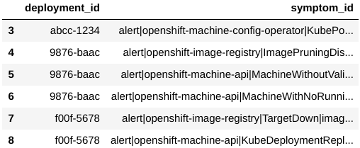
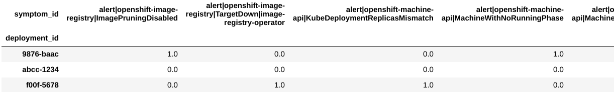
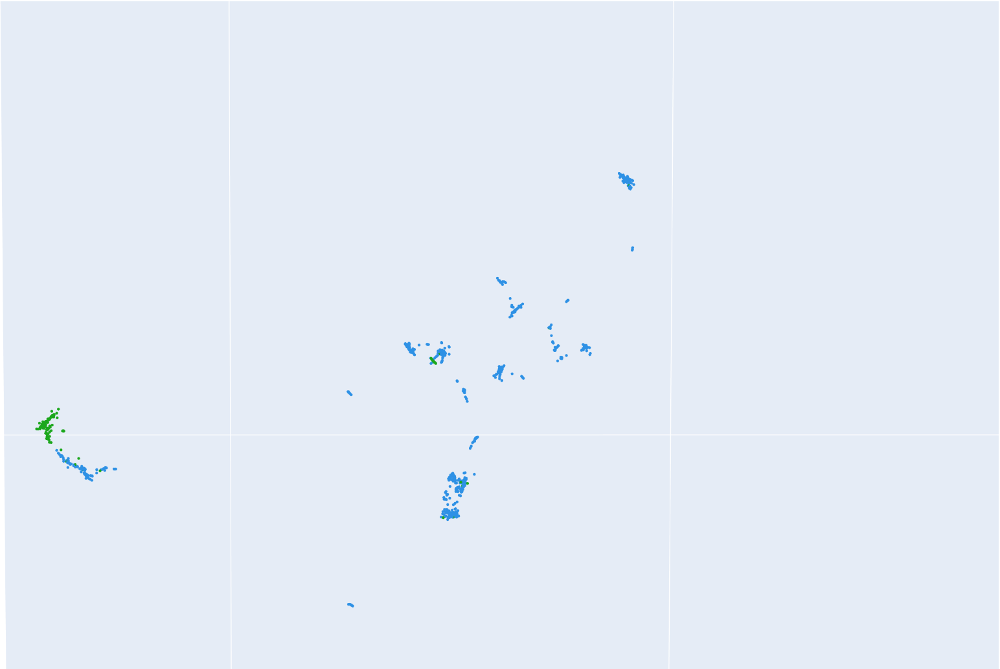
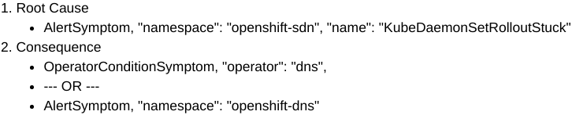
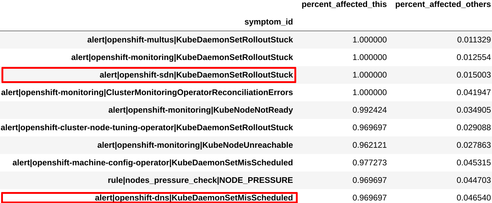
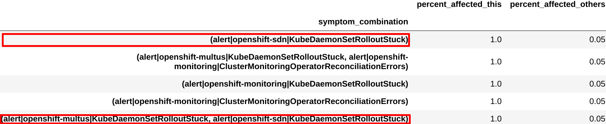
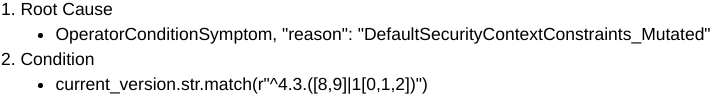
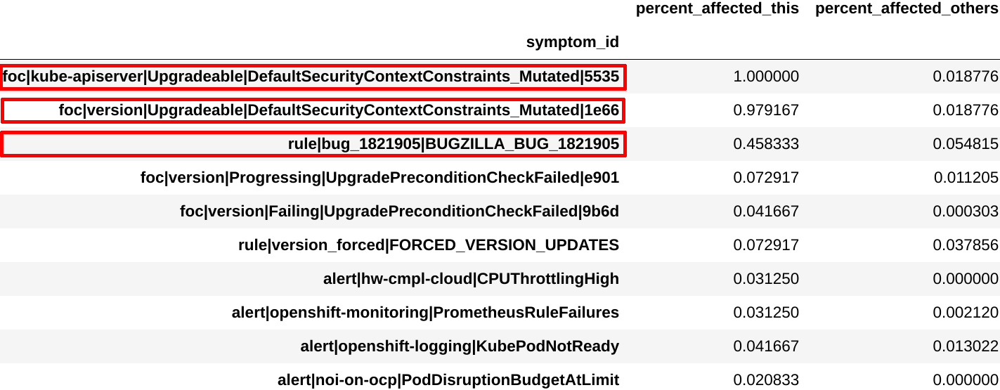
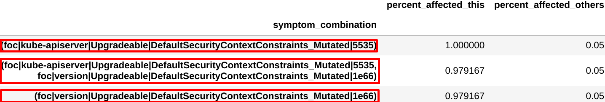

_Authors:_  Karan Chauhan (kachau@redhat.com)

_Date Created:_ 10 June 2020

_Date Updated:_ 21 January 2021

_Tags:_ unsupervised learning, dimension reduction, clustering, pattern mining, symptom, diagnosis, openshift, ccx

### Abstract

There are many ways in which an OpenShift (or any kubernetes platform) deployment can break. Therefore, monitoring systems continuously collect health and usage metrics from deployments, to help identify root cause in case of failure. However, this means that engineers have to investigate a ton of data in order to figure out the underlying issue. In this project we use machine learning to dig through such data and identify any recurring patterns in it that could hint towards the diagnosis of a problematic deployment. Specifically, we use clustering to find which deployments are affected by similar issues, and then use frequent pattern mining to surface the most informative symptoms and symptom combinations. Our initial results suggest that these methods are effective at finding meaningful patterns which can then be converted into rules that precisely define the diagnoses.

### Introduction

One of the ways to differentiate OpenShift from other kubernetes platforms is to deliver it as an easier to manage and more stable infrastructure. This means that customer support has to be less frequent, faster when required, and often proactive across hybrid cloud deployments. However, there are many ways in which a customer’s OpenShift deployment can break. So for support engineers, determining the exact underlying problem by manually inspecting the data collected from each deployment can be quite challenging.

We believe this task can be made less tedious with the help of machine learning. In this project, we explore ways to analyze the symptoms shown by problematic deployments, and identify any recurring patterns in them. These symptom patterns can then be used by engineers to concretely (and programmatically) define the diagnosis of the issues observed. This would not only help us streamline and scale support, but also enable us to be more proactive in providing support.

This blog describes our setup, approach, and results, as well as how to run our code and contribute to this effort.

### Terminology

_Note_: The following have been paraphrased from the Kraken Vision document

**symptom** -  an atomic unit of health data reported by an OpenShift deployment, that corresponds to an issue in it. For instance, an alert firing, an operator failing, an "insights rule" being triggered, etc. are all considered symptoms.

**potential diagnosis** - a particular combination of symptoms which is seen to occur often and which could hint towards the underlying problem with that deployment

**diagnosis** - a potential diagnosis that has been reviewed by engineers, confirmed as an acknowledged issue, and mapped to external information such as Bugzilla and KCS articles

### Methodology

We begin by fetching the Kraken Reports generated by the CCX team, via the kraken-core API. These reports summarize the health information for customer clusters. One of the pieces of information in these reports is the symptoms dataframe (fig. 1a), which lists the symptoms shown by each deployment. We use this as the dataset for our experiment. Note that this dataframe cannot be directly input to clustering algorithms, since it has multiple rows for the same deployment id and the data it contains is in string format. There are many ways to deal with such categorical data, and many of them are outlined in one of our blogs[1]. As a starting point, we use the one-hot encoding strategy. That is, we pivot the dataframe such that there is only one row per deployment and one column per symptom present (fig. 1b).

Figure 1a: Raw symptoms dataset

Figure 1b: One hot encoded symptoms dataset

As as result, we end up with a dataset that has a large number of columns (i.e. dimensions). Most clustering algorithms don't perform well on such datasets because of the “curse of dimensionality”[2]. So we first apply dimensionality reduction to create a 3-dimensional representation of our dataset. We explored the PCA[3] and UMAP[4] algorithms for this task, and found that the latter produced more meaningful results. Essentially, UMAP tries to create a low dimension representation in such a way that the "patterns" and "relationships" that exist in the original data are preserved as much as possible. That is, it tries to map deployments that show similar symptoms closer to one another as compared to those that show completely different symptoms. A snippet of the outcome of this step can be seen in figure 2.

Figure 2: Snippet of 3d representation of dataset; each point represents an OpenShift deployment. The green points are the deployments that were diagnosed with the known sdn-issue

Next, we cluster this low dimension data representation using DBSCAN[5]. This gives us an estimate of which deployments are similar to each other in terms of symptoms exhibited (and were therefore assigned to the same cluster/group). We explored k-means[6] and DBSCAN for this task, and concluded that the latter resulted in a clustering that was more coherent with domain knowledge.

Once we have the clustering/grouping, we apply FP-growth[7] within each cluster. This tells us which symptom combinations are seen most frequently in each cluster. Now to get to the diagnosis that the deployments in a given cluster supposedly share, we try to answer the question: what makes the deployments in this cluster different from the rest? That is, which symptoms and symptom patterns are the defining characteristic of these deployments?

For this, we compare the dominant symptoms and patterns in a given cluster with those in others, and determine which ones are unique to that cluster (fig. 3). For example, if a pattern (I, J, K) is seen in 95% of the deployments in a cluster, but only 2% otherwise, then that pattern is likely representative of the problem in those deployments. In this way, we calculate the most uniquely affecting symptoms and patterns for each cluster, and present them to the engineers as potential diagnosis definitions.

### Results

Since the data is mostly unlabeled, we rely heavily on feedback from subject matter experts to evaluate our approach. Nonetheless, two of the known labels that we did have were "sdn-issue" (fig. 3a) and "scc issue" (fig. 4a).

We examined the symptoms and combinations obtained from one of the clusters, and found that these were very similar to the ones engineers had used to define the existing "sdn-issue" diagnosis. This can be seen in figure 3.

Figure 3a: Definition for sdn-issue

Figure 3b: Top symptoms extracted

Figure 3c: Top symptom combinations extracted

Similarly, we examined the symptoms and combinations obtained from another cluster, and found that these were very similar to the ones engineers had used to define another existing diagnosis, "scc issue". This can be seen in figure 4.

Figure 4a: Definition for mutated scc issue

Figure 4b: Top symptoms extracted

Figure 4c: Top symptom combinations extracted

Lastly, we ran this analysis for one of the SRE teams at Red Hat and presented the results to them. From these results, the engineers were able to identify and define 6 new diagnosis definitions.

### Conclusion

In conclusion, our exploration thus far seems to suggest the following:

1. There is a good chance that, if deployments are assigned to the same cluster (group) by the clustering algorithm, then many of them share a common diagnosis.
2. Determining the most characteristic symptoms and symptom combinations in each group using frequent pattern mining can hint towards the potential diagnosis.

Since we are able to automatically extract meaningful symptoms and patterns without any input from human experts, we believe this is a fruitful area for further research. There are many ways to improve the existing methods, such as implementing a better representation learning, a better noise filtering, etc. To catalyze community participation, we have packaged our code[8] into an image and deployed it to a publicly accessible JupyterHub[9]. We encourage both subject matter experts and data scientists to review this work and provide feedback to improve it.

### References

[1] [Categorical Encoding](https://www.operate-first.cloud/data-science/categorical-encoding/docs/blog/blog.md)

[2] [Curse of dimensionality](https://en.wikipedia.org/wiki/Curse_of_dimensionality)

[3] [Princpal Component Analysis](https://en.wikipedia.org/wiki/Principal_component_analysis)

[4] [McInnes, Leland, John Healy, and James Melville. "Umap: Uniform manifold approximation and projection for dimension reduction." arXiv preprint arXiv:1802.03426 (2018).](https://arxiv.org/abs/1802.03426)

[5] [Ester, Martin, et al. "A density-based algorithm for discovering clusters in large spatial databases with noise." Kdd. Vol. 96. No. 34. 1996.](https://aaai.org/Papers/KDD/1996/KDD96-037.pdf)

[6] [K-means](https://en.wikipedia.org/wiki/K-means_clustering)

[7] [FP-growth](https://en.wikibooks.org/wiki/Data_Mining_Algorithms_In_R/Frequent_Pattern_Mining/The_FP-Growth_Algorithm#FP-Growth_Algorithm)

[8] [GitHub Repository](https://github.com/aicoe-aiops/openshift-anomaly-detection)

[9] [Operate First JupyterHub](https://jupyterhub-opf-jupyterhub.apps.cnv.massopen.cloud/)

### Project Material

#### Steps to get you started:

1. Visit https://jupyterhub-opf-jupyterhub.apps.cnv.massopen.cloud
2. Login with your google account
3. In this Spawn screen, select `openshift-anomaly-detection:latest`
4. Once your server starts, go into the directory named `openshift-anomaly-detection-yyyy-mm-dd-hh-mm`
5. Go to `notebooks`. Run the notebook titled `diagnosis-discovery-demo.ipynb`.

#### How to Contribute / Provide feedback

- GitHub Repo: https://github.com/aicoe-aiops/openshift-anomaly-detection
- You can open an Issue on the repo highlighting the bug or feature, or review existing Issues and submit PRs addressing them.
- You can also reach out to kachau@redhat.com for any questions.
